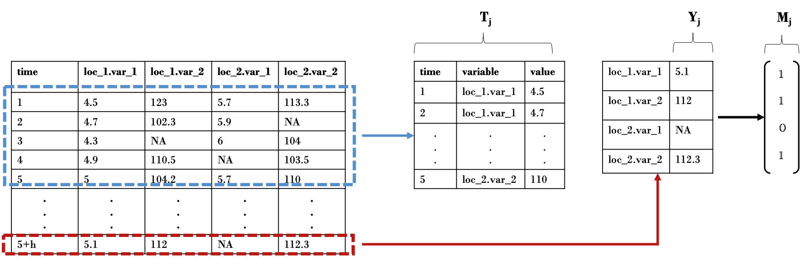
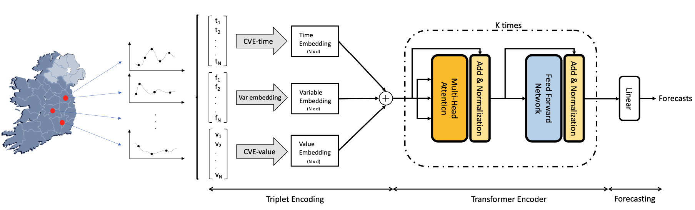

# SERT: A Transfomer Based Model for Spatio-Temporal Data with Missing Values

This repository contains the code for the paper, "SERT: A Transfomer Based Model for Spatio-Temporal Sensor Data with Missing Values for Environmental Monitoring", Shoari Nejad et al., 2023. ([arXiv](http://arxiv.org/abs/2306.03042)).


This work proposes two models, namely SERT and SST-ANN, for spatio-temporal forecasting. Both models are capable of performing multivariate spatio-temporal forecasting while handling missing data naturally, without the need for imputation. The first model is a transformer-based model, while the second model is an ANN with a spatio-temporal encoding scheme. The second model is capable of providing interpretable results with variable importance.

**Disclaimer:** 
- The data and code for the real-world case study is not available due to data protection and privacy concerns. However, they will be made available after the permission is granted by the data owners.  

- This repository is just for the purpose of reproducibility of the results. The code is not optimized for speed and memory. We will release a package with optimized code in the future.

## Data Format

We deal with spatiotemporal data with contineous inputs. An example of such a dataset and the input and output of the models are shown below: 




## SERT Model
SERT takes in each observation as a triplet (time, variable, value) and encodes it into a embedding vector that is the latent representation of the observation. Then a transformer encoder with a linear layer is used to predict the future values. The model is shown below:




## Citation
If you use this model in academic work please feel free to cite our paper

```
@misc{shorinejad2023sert,
      title={SERT: A Transfomer Based Model for Spatio-Temporal Sensor Data with Missing Values for Environmental Monitoring}, 
      author={Amin Shoari Nejad and Rocío Alaiz-Rodríguez and Gerard D. McCarthy and Brian Kelleher and Anthony Grey and Andrew Parnell},
      year={2023},
      eprint={2306.03042},
      archivePrefix={arXiv},
      primaryClass={cs.LG}
}
```
